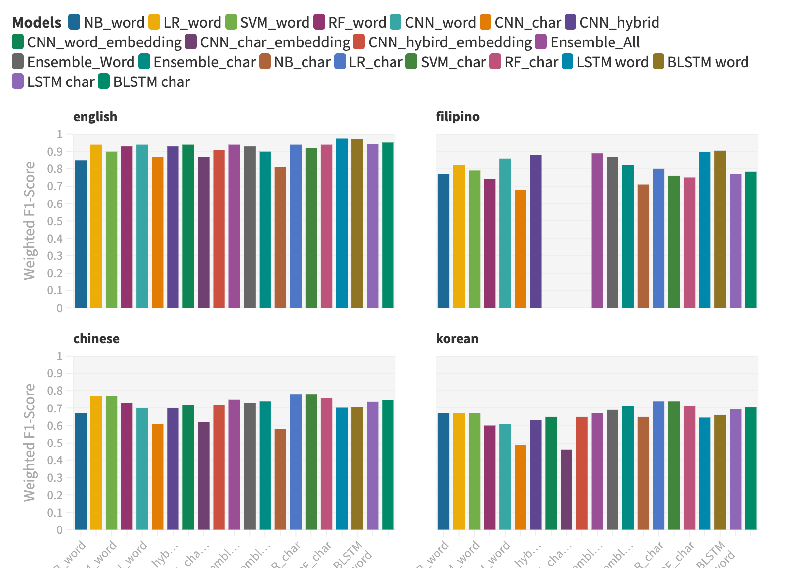

# Comparative Analysis of Detecting Offensive Speech in Multiple Languages on Social Media

- Dataset Preprocessing -> Data Preprocessing.ipynb
- Traditional ML Models -> Traditional ML Models.ipynb
- CNN -> CNN.ipynb
- Ensemble Predictor -> Ensemble.ipynb
- [Paper](paper.pdf)
- [Slides](slides.pdf)

## Team
- Rehan Ahmed
- Jimi Cao
- Romina Mir
- Prerak Pradhan
- Mauli Trivedi

# Results
Interative Results Bar Chart

